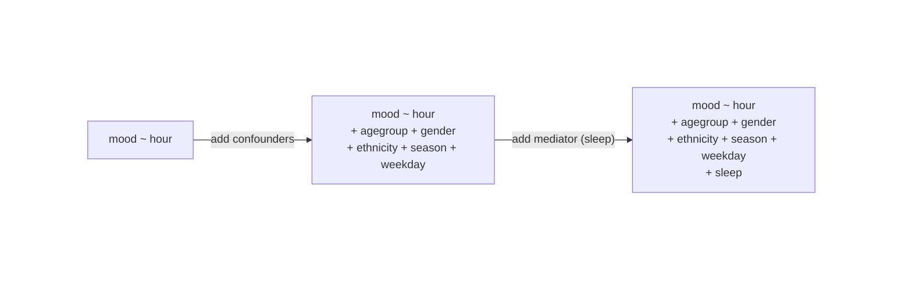
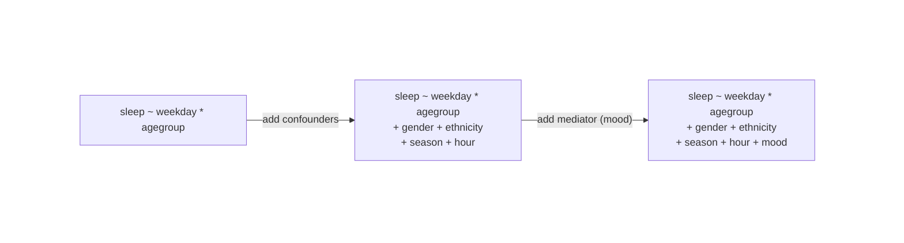

# Large-scale diurnal and weekly patterns of self-reported mood and sleep on an online cognitive-training platform

This code repository provides the relevant code used in the Lumosity project: **Large-scale diurnal and weekly patterns of self-reported mood and sleep on an online cognitive-training platform**. The main research questions involved in this project were:
1. What is the 24-hour rhythm of mood/sleep self-reports? Do demographic covariates confound this? Does sleep duration / mood confound the other variable?
2. What is the weekly rhythm of mood/sleep self-reports? Do demographic covariates confound this? Does sleep duration / mood confound the other variable?
3. Are there demographic subgroup differences between these sleep / mood rhythms? Are they confounded by other subgroups or mediated by the opposing outcome variable (mood / sleep duration)?

The first two questions are answered through a series of Type III One-Way ANOVAs, and the third question is answered through a series of Type III Two-Way ANOVAs. 
If all three model constructions are significant, the first and simplest linear model construction is used to extract coefficients for interpretation. 

## Code

The following files below follow a step-wise order, where the following one requires the preceding one being completed. 
For Python files, make sure you have installed `requirements.txt` within your choice of a virtual environment, and for R files, the first lines will check for the needed packages and install if needed.

| File Name | Programming Language | Description |
| -------- | ---------  | ----- |
| `preprocess.py` | Python (3.13) | Performs preprocessing of data file and creates new file to analyze
| `analysis.R`         | R (4.4.3)     | Performs the analyses using the preprocessed data file                  
| `graphs.py`    | Python (3.13) | Generates graphics of the key findings from the analysis          

## Analysis
The first two questions involved performing a series of Type III One-Way ANOVAs with the goal of identifying what the 24-hour and weekly rhythms of mood and sleep self-reports were in the dataset. 
Furthermore, these rhythms were strengthened by testing whether accounting for confounding variables would impact significance. If confounds did not impact results, the simplest model was utilized to extract coefficients of the relevant predictor. 

For example, to test for the **24-hour rhythm of mood reports in users**, the following set of models were defined:

If the ANOVA results returned a significant predictor term, the ANOVA test for the second model was run. This process repeats up until significance is not found or the models are all significant.

Assuming these three models are significant, the coefficients of the simplest model (leftmost) are interpreted. 
To obtain coefficients for all values, **Weighted Effect Coding** was used and a simple model was defined twice, one with reference 0/Mon and one with reference 12/Sun (for hour/weekday, respectively).
This way, all coefficients were relevant to the weighted average, and each coefficient had an attached value.

The third question involved performing various sets of Type III Two-Way ANOVAs, with the goal of identifying if the aforementioned hourly and weekly rhythms of mood and sleep varied by demographic differences. Furthermore, these rhythm variations were strengthened in the same way. 

For example, to test whether there was an interaction between **weekday and age on mood reports in users**, the following set of models were defined:

Coefficient extraction was more carefully conducted due to category overlap. For the most part, visuals were used alongside these analyses to better get a sense of meaningful trends. Post-hoc comparisons were not performed beyond the same model constructions.

## Data 

This repository includes programming files in both Python and R, as well as some supplemental documents. The full dataset is property of Lumos Labs and is available upon reasonable request from the company. 
Since we cannot disclose the dataset, the file `data_format.csv` provides an example row and column name convention used in the analyzed dataset. The columns and valid values for each type are listed below:

### Original Columns (Before Preprocessing)
| Variable | Type       | Values|
| -------- | ---------  | ----- |
| `mood`   | Ordinal / Likert| `-2`, `-1`, `0`, `1`, `2`
| `quality` | Ordinal |  `-2`, `-1`, `0`, `1`, `2` 
| `hour`   | Categorical    | `0`, `1`, `2`, `3`, . . .  ,`23`      
| `weekday`| Categorical     | `Mon`, `Tues`, `Wed`, `Thurs`, `Fri`, `Sat`, `Sun` 
| `month`  | Categorical     | `Jan`, `Feb`, `Mar`, `Jun`, `Jul`, `Aug`, `Sep`, `Oct`, `Nov`, `Dec`
| `agegroup`| Categorical    |`[15,20)`, `[20,25)`, . . . , `[80,85)`, `[85,90]`
| `gender`  | Categorical   | `male`, `female`
| `ethnicity`| Categorical   | `white`, `black`, `hispanic`, `asian`, `native_american`, `pacific_islander`, `other`

### Analyzed Columns (After Preprocessing)

| Variable | Type       | Values|
| -------- | ---------  | ----- |
| `mood`   | Ordinal / Likert| `-2`, `-1`, `0`, `1`, `2`
| `sleep`  | Ordinal / Ratio |  `5`, `6`, `7`, `8`, `9` 
| `hour`   | Categorical    | `0`, `1`, `2`, `3`, . . .  ,`23`      
| `weekday`| Categorical     | `Mon`, `Tues`, `Wed`, `Thurs`, `Fri`, `Sat`, `Sun` 
| `season` | Categorical     | `winter`, `spring`, `summer`, `fall`
| `agegroup`*| Categorical    | `20–29`, `30–39`, `40–49`, `50–59`, `60–69`, `70–79`
| `gender`  | Categorical   | `male`, `female`
| `ethnicity`**| Categorical   | `white`, `black`, `hispanic`, `asian`, `other`

Columns not relevant to analysis are not shown in the **Analyzed Columns**.\
*`agegroup` was re-aggregated to decades, where groups `[15,20)`, `[80,85)`, and `[85,90]` were excluded due to low sample sizes and not comprising a complete decade.\
**`ethnicity` excluded the `pacific_islander` and `native_american` groups due to low sample sizes\
